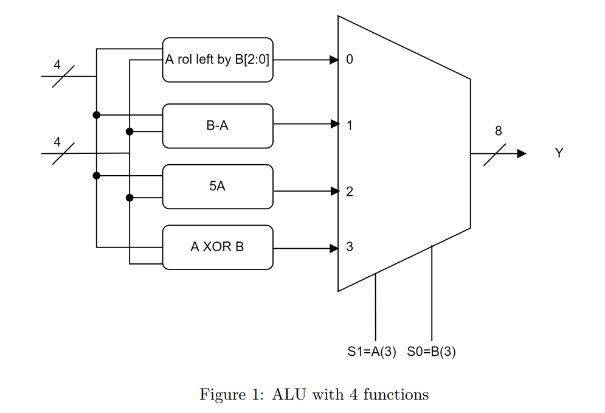

# 4-Bit-Arithmetic-Logic-Unit
EE214 - Digital Circuits Lab

## Features

* Used Behavioral-Dataflow modelling for writing VHDL description . 
* Consists of totaly 8 inputs A3 A2 A1 A0 B3 B2 B1 B0 and 8 outputs A3 A2 A1 A0 B3 B2 B1 B0  .

    | S1 S0 |  ALU Output                            |
    |-------|----------------------------------------|
    | 0  0  | Rotate left A by B[2:0] number of bits |
    | 0  1  | Performs B-A Operation                 |
    | 1  0  | Produces output as 5*A                 |
    | 1  1  | Performs bitwise A xor B Operation     |
    
* In this problem MSB of inputs A and B are also working as selection lines. S0 is connected to MSB of input B [B(3)]
  and S1 is connected to MSB of input A [A(3)].

## Author

- [@Pratik Yabaji](https://pratik-yabaji.github.io/Portfolio/)
